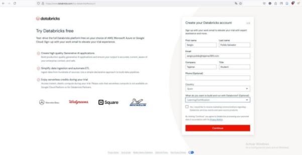
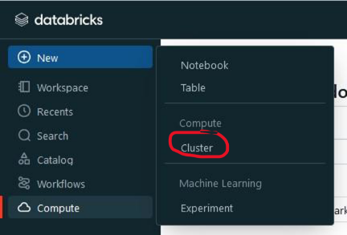
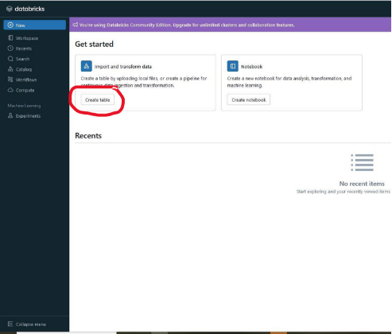
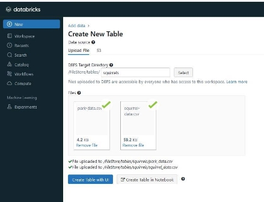
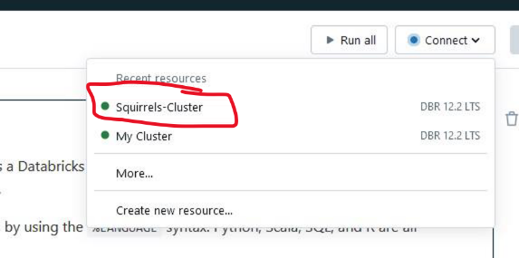
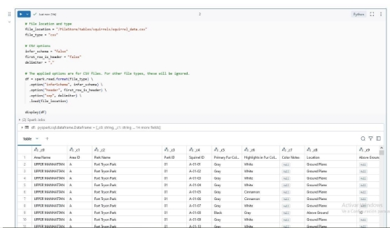
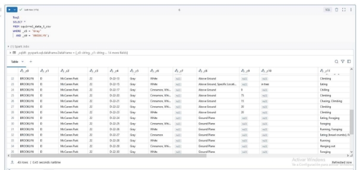
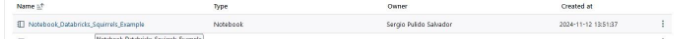

# Databricks-cluster-and-notebook
Configuración de la cuenta básica de DataBricks, creando poosteriormente un clúster, añadiendo varias tablas de datos y creando un notebook en el que ejecutar consultas.
# TITULO
https://colab.research.google.com/ DataBricks  

Nombre1 , Nombre2... DATABRICKS 

1-  Registrar cuenta como personal. 

2-  Validar el correo 

3-  Crear el clúster 

4-  Crear las tablas 

5-  Adjuntar los csv del repositorio y darle a create table in notebook

6-  Seleccionar el cluster creado anteriormente

7-  Modificar el nombre de las tablas en el notebook si da error. A continuación, dar 

click a “Run all” 

8-  Hemos probado la siguiente consulta

9-  Al darle a los 3 puntos se puede exportar el notebook como un archivo DBC, .py, 

notebook de python y HTML. 

